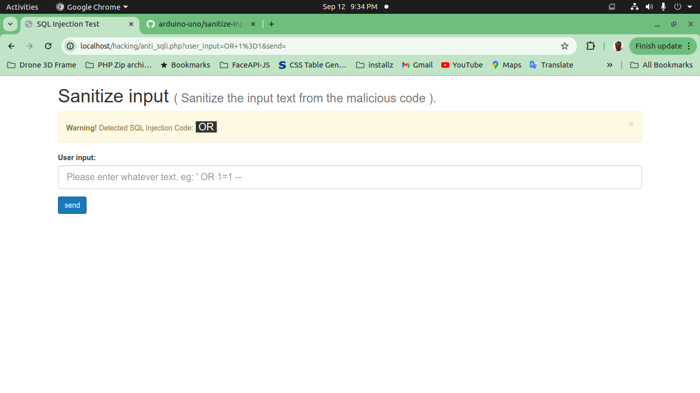

# Sanitize Input
 Sanitize the input text from the malicious code.

## Screenshot
<p align="center"></p>

## Functions
```php
    <?php
        function sanitize_input( $input = null ) {
            
            // Change input to uppercase
            $input = strtoupper( $input );

            // Array SQLi codes
            $sqli_codes = array('OR',
                    'AND',
                    'ORDER',
                    'BY',
                    'NULL',
                    'ALL',
                    'SELECT',
                    'FROM',
                    'WHERE',
                    'UNION',
                    '[-+=*\'\"]' // filter any special chars eg: quote & double quotes
                );
            
            // converts the array into a regex friendly or list
            $sqli_code = implode('|', $sqli_codes);
            $result = preg_match('/' . $sqli_code . '/', $input, $matches);

            return $matches[0];

        };

        function check_input( $input = null ) {

            $result = sanitize_input( $input );

            if ( strlen( $result ) > 0 ) {
                return TRUE;
            } else {
                return FALSE;
            };

        };
    ?>
```

## Examples

### Example #1: How to check any SQLi attempt.

```php
    <?php
    	$input = $_GET['user_input'];
        if ( isset( $input ) ) {

            if ( check_input( $input ) ) {
                echo "Warning: Detected an SQL injection attack!";
            } else {
                echo "Success: This page is secure from SQL Injection attacks.";
            };

        };
    ?>
```

### Example #2: How to detect any SQLi or other malicious codes?

```php
    <?php
    	$input = $_GET['user_input'];
        if ( isset( $input ) ) {

            if ( check_input( $input ) ) {
                $result = sanitize_input( $input );
                echo "Warning: Detected SQL Injection Code:&nbsp;Detected SQL Injection Code:&nbsp; <span style='background-color:#333;color:#fff;'>&nbsp;{$result}&nbsp;</span>";
            } else {
                echo "Success: This page is secure from SQL Injection attacks.";
            };

        };
    ?>
```

## Remember:

* This is an open source project and free.
* Share our repository.

